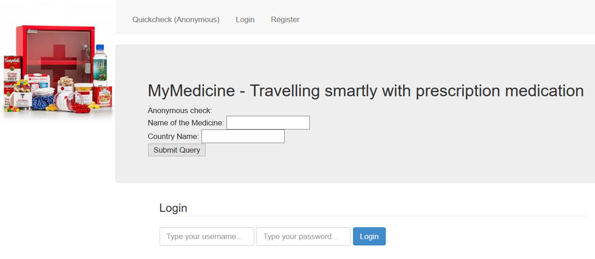

# MYMEDICINE
MYMEDICINE - A mobile app and personal assistant for travelling abroad with medication

Version: v1 / Last updated: 2021-05-03

## Description

This repository contains a summary of project .

MYMEDICINE is the prototype of a personal assistant application for helping the user organize his/her own medication cabinet and translate substance nomenclature into other languages, measurement units &amp; legislation permissions.

For more details, please check 